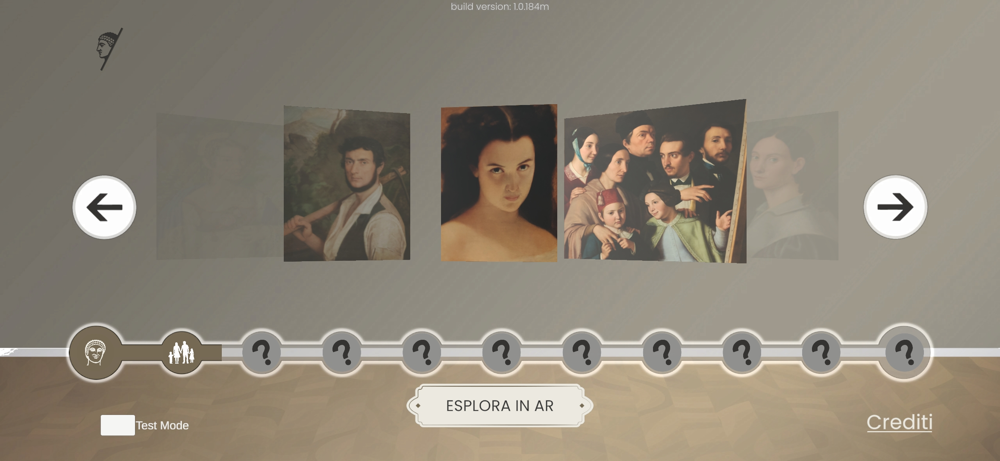
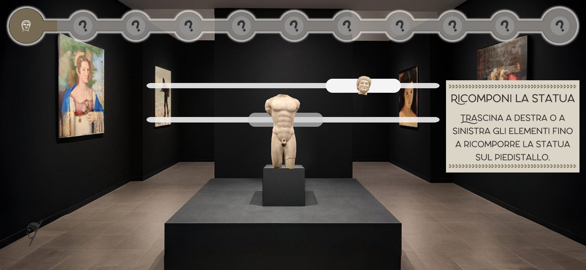
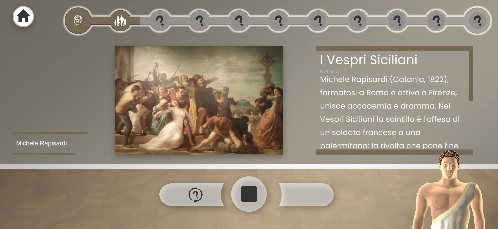
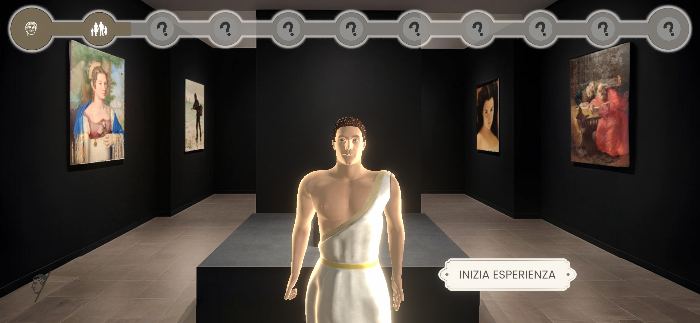
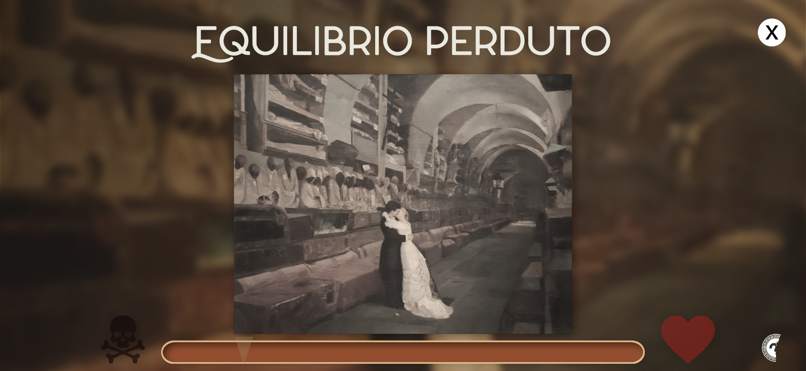
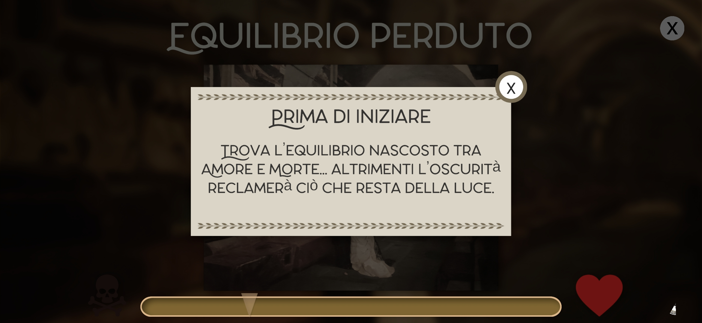
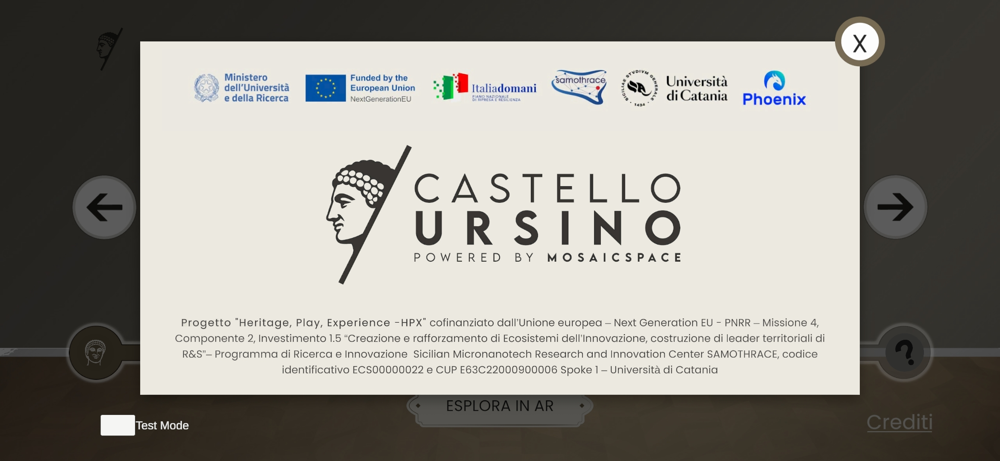
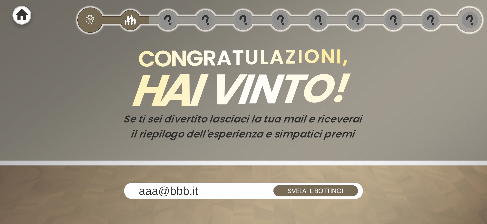

  

# Castello Ursino AR — Open Dataset

This repository provides an open-access dataset produced for the **Castello Ursino AR** project, developed by **Phoenix Srl**.  
The dataset contains multimodal digital assets acquired at the **Pinacoteca of Catania (Castello Ursino Museum)** to support the creation of augmented-reality experiences.

---

## 📌 Project Context

This dataset has been produced within the **HPX – Heritage, Play, Experience** initiative, part of the  
**Sicilian Micronanotech Research and Innovation Center – SAMOTHRACE**,  
**Spoke 1 — University of Catania**, funded by:

- **PNRR – NextGenerationEU**
- **Mission 4, Component 2, Investment 1.5**

---

## 📂 Repository Contents

### 🏛️ 3D Assets
Key 3D assets created for the AR experience, including:

- **Castello Ursino** — complete 3D reconstruction of the historical building  
- **Mount Etna** — volcano model with graphic and audio layers simulating eruption scenarios  
- **Kouros Statue** — 3D model of the ancient kouros exhibited in Catania

---

### 🧭 Spatial Environment Maps
3D spatial maps captured inside the museum’s pinacoteca rooms.  
These maps support **markerless environment recognition**, including:

- Room-scale spatial scans
- Map used for **automatic recognition of the Kouros statue**

---

### 🖼️ Artwork Pictures
Processed photographic material of selected paintings from the museum.  
These images are used for **AR-based artwork recognition** and contextual museum experiences.

---

### 🗂️ Artworks Data

Folder containing structured information about the paintings, used by the smart assistant to provide details to users.

---

| Screenshot                                 | Description                                                                                    |
| ------------------------------------------ | ---------------------------------------------------------------------------------------------- |
|          | **Main Menu** – Selection of artworks to explore in AR.                                        |
|  | **Kouros Puzzle** – Reassemble the statue by dragging the fragments into place.                |
|       | **Artwork Information** – Historical and artistic details with guided narration and Smart Assistant help.               |
|    | **Narrating Avatar** – The Kouros comes to life and guides the user through the experience.    |
|               | **“Lost Balance” Minigame** – One of 9 available minigames.                   |
|      | **Minigame Tutorial** – Intro instructions: find the balance between “love and death.”         |
|            | **Credits Screen** – Project partners, research institutions, and funding (PNRR – SAMOTHRACE). |
|        | **Final Screen** – End of the experience with optional email submission for rewards.           |

## 📜 License

All assets are provided exclusively for **research, education, cultural heritage enhancement, and non-commercial use**.  
For commercial exploitation, redistribution, or derivative markets, please contact Phoenix Srl.

---

## 🤝 Credits

Developed by **Phoenix Srl** in collaboration with **University of Catania** as part of the SAMOTHRACE program.

---

## 📧 Contact

For inquiries and project information:  
**Email:** ricercaesviluppo@phoenixsrl.it  
**Website:** https://www.phoenixsrl.it/

---

Thank you for exploring the Castello Ursino AR dataset and supporting digital cultural heritage research!
